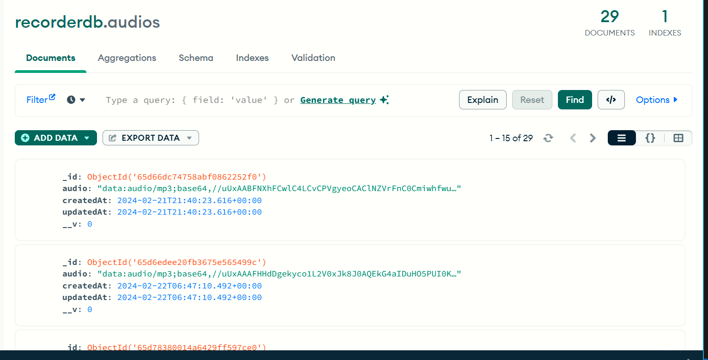

# MERN_VoiceRecorder
MERN stack Audio Recorder using Redux Toolkit for api's &amp; mic-recorder-to-mp3 library.
# npm run dev

 

 

I have converted the Audio Recording into base64 text format to save it into the mongoDB.
then I decoded that base64 format to put it in as voice in a audio player.
 
I used the concurrently library so that you can use npm run dev command in the parent directory,
to run both the client Side and Server Side simultaneously.
